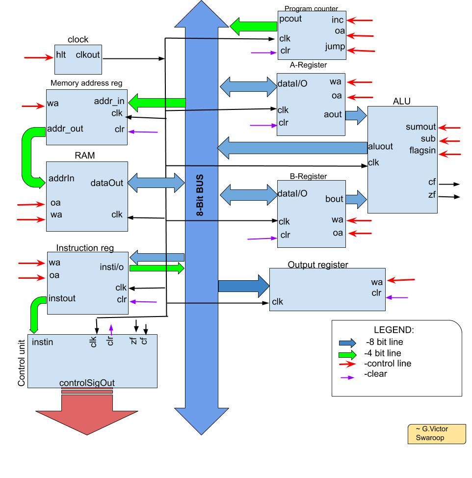

# Simple 8-Bit Computer
## Hardware Specifications:
* 8 bit processor
* 16 byte ram, 4 bit address locations each being 8 bit long
* 2 General purpose registers (Accumulator and B-register)
## Architecture:

**Components:**
* ***Clock module:***
Takes in one control signal called halt(*hlt*). As long as *hlt* is low, the module outputs a square wave with the time period set to 40ns by default. When *hlt* goes high, output stays in the previous state.
* ***Bus:***
Bus is just a combination of 8 wires (to support 8 bit data transfer), used to act as an interface between various modules to allow data transfer between them. Since it's just a combination of wires, it can't store anything...
* ***General Purpose registers:***
Two general purpose registers (*A and B registers*) are used in the design. It stores an 8 bit value. Control signals being output enable (*oe*), write enable(*we*) and clear(*clr*). Also takes a clock signal to work in sync with the rest of the system. When output enable is set, the contents of the register are presented on the data pins. When *write enable* is set, the value set on the data pins are latched in at next raising edge of the clock. When *clear* is set, 0x00 is latched into the register at the next raising edge of the clock. Clear being more weighted than write enable.
* ***Instruction register:***
It stores the instruction being executed and is updated after each instruction cycle. It's similar to  the general purpose register and stores 8 bit value and control signals are same as the GPR's. But it can output only 4 least significant bits when *output enable* is set.
* ***Output register:***
It too stores 8 bit value but can't output it. Control signals are *'write enable'* and *'clear'*. When *write enable* goes high, the contents on the bus are latched-in at the next raising clock edge. When *clear* goes high, 0x00 is latched in.  It acts as a display to output the computed result. Register contents get printed to the terminal whenever they change.
* ***Arithmetic and Logic unit (ALU):***
Here, it's seemingly less complex than the name implies;) It's a 8 bit ripple carry added. The operands are fed directly from the A and B registers and outputs the results to the bus. It can perform binary addition and subtraction. Since we aren't doing much complex arithmetic, the design is implemented at gate level. The ripple carry adder is implemented at gate level by stacking up 2 4-bit adders, which in turn is just a combination of full adders. For subtraction, a special control signal called *'sub'* is used. When *'sub'* goes high, the contents of B-register are inverted and a binary 1 is carried in, effectively computing the 2's compliment of B which is then added with A to get the final result. 
Control signals are *'sub'* and *'sum out'*, the latter used to output the result to the bus.
Additionally, it also supports 2 flags namely *zero flag* and *carry flag*. It takes an additional control signal called *'flags in'* to occasionally update the flags.
* ***Program counter:***
It always stores the address of the next instruction to be executed. So, it's updated after each instruction. Since our memory addresses are 4 bits long, a 4 bit binary counter is used. Control signals are *increment (inc), output enable (oe), clear (clr)* and *jump (jmp)*. When *increment* goes high, the contents are incremented by one, *clear* overwrites the contents with 0x0 and when *jump* is set, the 4 least significant bits on the bus are latched in. All the three happen in sync with the clock at the raising edge. *Output enable* outputs the contents to lower half of the bus to the bus.
* ***Memory address register:***
It stores the memory to be accessed from the ram. It's a 4 bit register. Control lines are *write enable* and *clear*. *'Write enable'* writes the lower 4 bits on the bus to the register and *'clear'* overwrites the contents with 0x0. It always outputs it's contents on the address lines of the ram.
* ***Ram:***
 It's the memory block our processor will be working on. It's 4 bit addressable giving 16 possible locations each being 8 bit long. Control signals are *write enable* and *output enable*, *write enable* is set to latch in 8 bit data and setting *output enable* outputs 8 bit data on the data lines. Both of them require a valid address to be set on the address lines.
* ***Control unit:***
It's the actual module which controls the rest of the system by setting the control signals of various modules whenever needed to accomplish a certain process. Here, it's just a lookup table which takes the opcode (4 most significant bits of the instruction) from the instruction register and splits out a vector of control signals. It also takes the flag registers to process conditional instructions.
## Instruction set design: 
4 most significant bits of the instruction are allocated for opcode allowing 16 possible machine instructions.
#### **Data Addressing modes:**
* **Immediate addressing:** The desired value (operand) is present as binary number in the instruction
* **Absolute addressing:** Instruction contains address which is holding the desired value in memory.
## Machine instructions:
Each instruction starts with a fetch cycle to fetch the instruction from memory. Each fetch cycle consumes 2 clock cycles. At the end of each fetch cycle, we end up having the next instruction to be executed in the instruction register. The rest of the instruction consumes 3 clock cycles each, making each instruction 5 clock cycles long.
* **NOP instruction:**
**Opcode: 0x0*
Does nothing. May be used to add delay between instructions...
* **LDA (load A) instruction:**
**Opcode: 0x1*
Takes a 4 bit address as operand. Loads the value at the given address location in memory to A-register (Accumulator).
* **ADD instruction:**
**Opcode: 0x2*
Takes a 4 bit address. Loads the value at given address into B register, computes the sum of A and B registers in ALU and stores the result in the accumulator.
* **SUB instruction:**
**Opcode: 0x3*
Takes the address, loads the value at the address into B-register, computes the difference of A and B-registers and stores in the accumulator
* **STA (store A) instruction:**
**Opcode: 0x4*
Takes an address and stores the contents of A-register in the memory at that location.
* **LDI (load immediate) :**
**Opcode: 0x5*
Accepts a 4 bit immediate value and stores it in the accumulator.
* **JMP (jump):**
**Opcode: 0x6*
Program execution jumps unconditionally to the instruction at the given address
* **JC (jump if carry):**
**Opcode: 0x7*
Program execution conditionally jumps to the instruction at given address if the *carry flag* is set ie, if the last instruction caused a carry out in the ALU.
* **JZ (jump if zero):**
**Opcode: 0x8*
Conditionally jump to instruction at given address if last arithmetic instruction resulted in zero.
* **OUT instruction:**
**Opcode: 0xE*
Moves the contents of the accumulator to output register to display the result (here prints to the terminal)
* **HLT (halt) instruction:**
**Opcode: 0xF*
Ends the program execution and halts the system.
### Building from source:
This project is built and developed using [Icarus verilog](http://iverilog.icarus.com/) and [gtkwave](http://gtkwave.sourceforge.net/), an open source verilog interpreter and waveform viewer.If iverilog is installed in the system, program files are compiled using:
```
iverilog -o <output_file.out> <input_file.v>
```
then it can be executed using:
```
vvp <output_file.out>
```
All the test benches written here, generates a dump file named "vars.vcd" by default which can be used to view output waveform with gtkwave using:
```
gtkwave vars.vcd
```
 The code isn't synthesized or tested on a ASIC chip or an FPGA board and some changes may be required to synthesize the design.
### References and credits:
* Special thanks to Ben Eater for unconditionally sharing his knowledge. This project is just a verilog implementation of his 8-bit breadboard computer. He makes excellent videos on computer science and electronics on YouTube. Check em out [here](https://www.youtube.com/channel/UCS0N5baNlQWJCUrhCEo8WlA)
* Verilog language essentials were referred from an Nptel course on hardware modeling which is also available on YouTube for free. Find it [here](https://www.youtube.com/watch?v=FWE0-FOoE4s&list=PLUtfVcb-iqn-EkuBs3arreilxa2UKIChl)
* Digital computer electronics by Albert Paul Malvino is a great book to start off with digital electronics and computer architecture. This project is broadly described in the "simple-as-possible (SAP) computer" part of this book.

